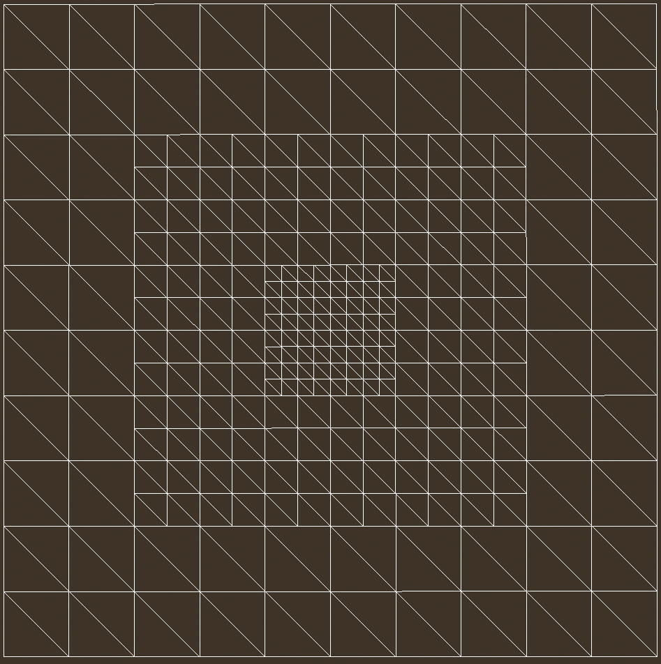
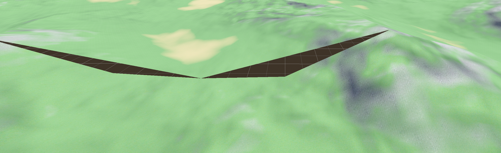
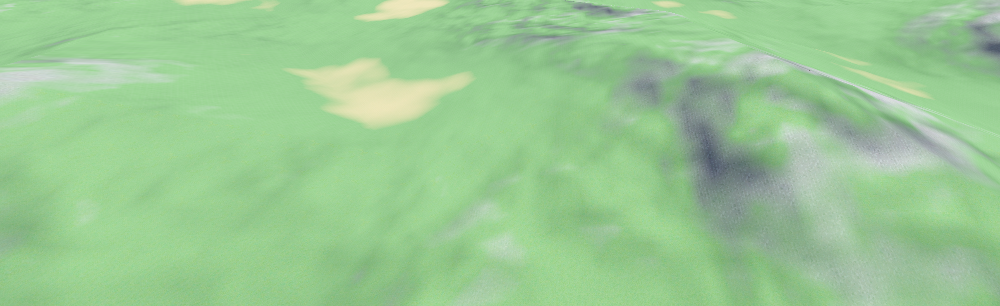

# Procedural Clipmap Terrain Generator

This is a procedural terrain generator based off of the theory presented by Mike J Savage:
[https://mikejsavage.co.uk/geometry-clipmaps/](https://mikejsavage.co.uk/geometry-clipmaps/)

The implementation in godot utlilizes double precision, allowing for a virtually infinite terrain.

## Basic Idea

Terrain in the engine is generated using heightmaps, which are grayscale textures produced by a custom C++ noise generator. These heightmaps are fed into vertex shaders, which adjust the position of each vertex based on the height value stored in the red channel of the texture. This allows the surface of the terrain to update quickly and dynamically.

Of course, rendering the entire landscape at maximum detail would be overkill — especially since fine details far from the camera aren’t noticeable to the player. To optimize performance, the terrain is split into square chunks, each using a level-of-detail (LOD) system:  

- Chunks close to the camera use dense meshes with more vertices for high detail.
- Chunks further away use fewer vertices for lower detail.
- The chunk directly beneath the camera always uses the highest resolution.

A common problem with LOD terrain is the appearance of seams where two chunks of different resolutions meet:  
  
To fix this, edges are stitched together. The higher-resolution edge is interpolated so that every other vertex lines up with the lower-resolution edge:  
  
This creates smooth transitions between chunks without resorting to heavier techniques like “skirts” or complex triangle stitching, making it both simple and efficient.

Geometry alone isn’t enough, though — lighting can break if normals are only calculated from the mesh resolution. To solve this, all heightmaps are generated at full quality regardless of the mesh’s vertex density. The fragment shader then interpolates lighting values as if every chunk had the same number of vertices. This has two major benefits:
- Normals look smooth across all chunks, no matter the LOD.
- Heightmaps can be reused freely across meshes of different resolutions.
Generating every heightmap at full quality adds some cost, but it solves multiple rendering problems at once and keeps the terrain looking consistent.

The system also adapts as the camera moves. When the camera crosses certain thresholds, chunks are shifted around dynamically to keep coverage continuous without rendering unnecessary detail:

Behind the scenes, all heightmaps are stored in a HashMap, with their keys representing world-space coordinates. If a heightmap for a given location doesn’t exist yet, it gets generated on the fly. Otherwise, the existing one is reused. Since shaders only need references to these textures (not copies), assigning them to chunks is fast and lightweight.